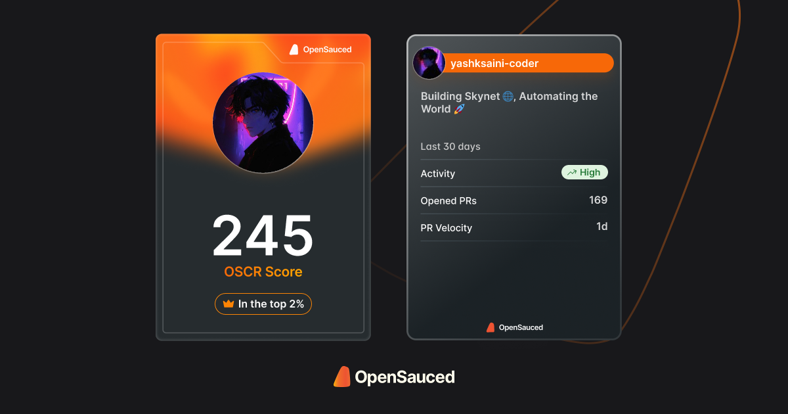

<!-- 

  <!-- 

-->

 

  
<!-- Main Header section -->

<!-- 

  

 -->

  
  
  
  
  
  
  
  
  
  
  

 

<!--  -->

<!-- |  |  |
|:-------------------------------------------------------------------------------------------------:|:-------------------------:| -->

  <table>
    <tr>
      <td align="center" color="white">
        
      </td>
      <td align="center">
        
      </td>
    </tr>
  </table>

  <!-- Secondary Section -->

  

    
🏆 Trophies

    

      
    

  

    
    
    
    
    
    
    
    
    
    
    
    
    
  

<!--- About ME  -->

<i>&nbsp; Building & Shipping Products with open source.</i>   

👋 I'm ***Yash K. Saini***, an Open Source Developer from India, who is super into Open Source stuff, Data Science, AI/ML and Developing & Contributing to different Open Source Projects and Organizations.

🔥 I have collaborated and conntributed to many projects in Open Source communities for over  3 years. 

✍ Also I write blogs on [Dev.to](https://dev.to/yashksaini) and [Medium](https://medium.com/@yashksaini) about my experiences and learnings in the field of Data Science, AI/ML, Open Source and Web Development.

📈 &nbsp; I am currently building my discord community for open source developers and Beginners in Open Source at [Discord](https://discord.gg/RAjEBUMYBu).

🔖 &nbsp; Also contributing to **DEV** & **Quira** challenges and got my PRs merged.

🚀 &nbsp; I've established myself in the [Top 2%](https://github.com/anuraghazra/github-readme-stats?tab=readme-ov-file#github-stats-card) of GitHub by contributing to _110+_ projects with _350+_ Pull Requests, participating & engaging with different communities, and earning a lot of reputation.

🎓 &nbsp; I'm also UpGrad certified Data Science candidate, completed 6 months training in Data Science, Machine Learning, Storytelling to provide Insightful results to my clients.

🎁 &nbsp; I daily share my day to day updates and updates that can also help others on **[Twitter](https://twitter.com/EasycodesDev)** and **[LinkedIn](https://www.linkedin.com/in/yashksaini/)**.

🏆 &nbsp; I also secured 11th Rank in GSSoC-Ext'24 (contributor) with `350+` PRs, solved `300+` issues and Top contributed in `5+` Projects.

🎯 &nbsp; I also helped built [Sneaky Package](https://github.com/AmateursLeague/sneaky-package) Python Library in GSSoC-Ext 2024 and will continue working on more open source projects.

😄 &nbsp; Besides that, I make side projects, brainstorm ideas, and keep learning new stuff.

## 📚 Latest Blog Posts

<!-- BLOG-POST-LIST:START -->
- [First look into Daytona + TypeScript Integration](https://dev.to/yashksaini/first-look-into-daytona-typescript-integration-51i4)
- [[Boost]](https://dev.to/yashksaini/-4c4o)
- [RAG Chatbot](https://dev.to/yashksaini/rag-chatbot-3bce)
- [Is Public Learning the most Effective way ?](https://dev.to/yashksaini/is-public-learning-the-most-effective-way--432g)
- [DSA v/s Web Dev](https://dev.to/yashksaini/dsa-vs-web-dev-3h9m)
<!-- BLOG-POST-LIST:END -->

 

<!-- 
 

  

 -->

#  My GitHub Metrics

  
Expand
 

| Overview | Follow up Issues & PRs |
|:--------:|:-------------------------:|
|  |  |
| Leetcode Stats | Notable Contributions |
|  |  |
| Achievements | Language Activity |
|  |  |
| Discussions | Reactions |
|  |  |

                     
 

<!-- Support Me Here --> 

#  Sponsor me 

#### *I have done significant contributions to the Open source community and you can support and motivate me to continue work and giving more to the open source space.*

  
  
  </a>

 

