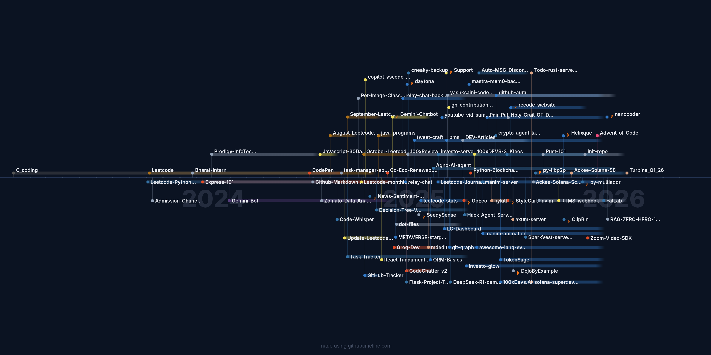
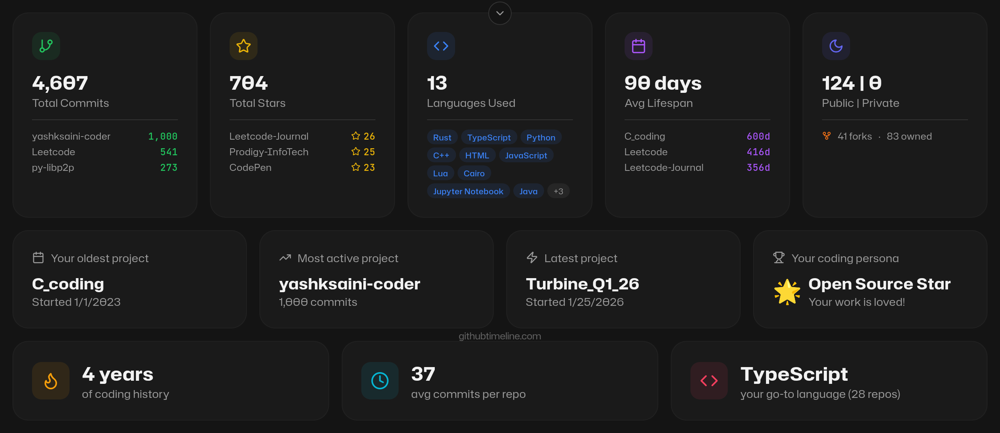

# 👨‍💻 Software Developer & AI Enthusiast

### Hi there 👋, I'm **Software Developer**!

Hi, I'm an Engineer, building in public, share what I'm working on and learning. Currently learning about AI, ML, and more on low-level programming such as C, C++, and Rust.

Where I'm not working, I'm reading books and writing blogs, building projects, learning, LLMs, RAG, System Design, DevOps, Web3 and Cloud.

##  | [Bounty 103$](https://x.com/yash_k_saini/status/1886322902573715709) | [Bounty 81$](https://x.com/0xCracked_dev/status/1951544807316201622) | [Bounty 7$](https://x.com/yash_k_saini/status/1883502087688073345) |

---

<!--
## 📝 What I've done
---

- Participated in ***[Kaggle](https://www.kaggle.com/yashsaini007)*** competitions (Competitions Contributor)
- Participated & won 5+ hackathons
- Built Python Packages during OSS events
- Writing blogs on **[Dev.to](https://dev.to/@yashksaini)** about my experiences and learnings

-->

## 📦 Skills

---

 
<!--  -->

<!-- ## 📚 Latest Blog Posts -->

<!-- BLOG-POST-LIST:START -->
- [Kleos CLI: Mindsdb Knowledge Base supercharged](https://dev.to/yashksaini/kleos-cli-mindsdb-knowledge-base-supercharged-1a83)
- [What does not Giving up get you ? Prime example](https://dev.to/yashksaini/what-does-not-giving-up-get-you-prime-example-2bn9)
- [How I built a AI Agent server](https://dev.to/yashksaini/how-i-built-a-ai-agent-server-3315)
- [Automate Discord Messages](https://dev.to/yashksaini/automate-discord-messages-30ip)
- [The Friendly Future: How AI Makes Life Easier and Safer for Everyone](https://dev.to/yashksaini/the-friendly-future-how-ai-makes-life-easier-and-safer-for-everyone-4de8)
- [First look into Daytona + TypeScript Integration](https://dev.to/yashksaini/first-look-into-daytona-typescript-integration-51i4)
<!-- BLOG-POST-LIST:END -->

<!-- Youtube video sections -->

<!-- ### 📺 Latest YouTube Videos -->

<!-- BEGIN YOUTUBE-CARDS -->

<!-- END YOUTUBE-CARDS -->

<!-- 

 -->

<!-- Support Me Here -->

<!-- #  Sponsor me -->

 

<!-- 
 -->

<!-- sponsors -->

<!-- 

  
  
  </a>

 -->