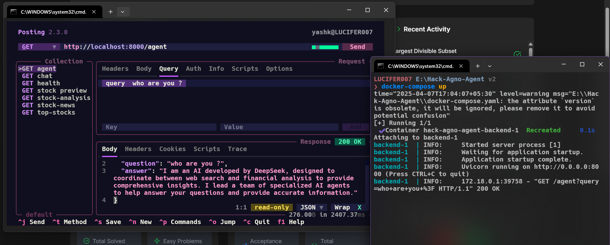

<!-- 

 

 -->

### Hi there 👋, I'm **Software Developer**! 

Addicted to ***Code***, ***Anime***, ***Agentic AI*** applications. 
Currently learning, LLMs, RAG, System Design, DevOps, Web3 and Cloud.

##  | [Bounty 103$](https://x.com/yash_k_saini/status/1886322902573715709) | [Bounty 7$](https://x.com/yash_k_saini/status/1883502087688073345) |
---

<!--
## 📝 What I've done
---

- Participated in ***[Kaggle](https://www.kaggle.com/yashsaini007)*** competitions (Competitions Contributor)
- Participated & won 5+ hackathons
- Built Python Packages during OSS events
- Writing blogs on **[Dev.to](https://dev.to/@yashksaini)** about my experiences and learnings 

-->
  
## 📦 Skills
---

<!-- ## 📦 Open Source Projects & Contributions
---

### [Mastra Mem0 Backend](https://github.com/yashksaini-coder/mastra-mem0-backend)
- Built a Multi-Agent AI Backend using Mastra & Mem0.
- With a worklfow to search & send  emails to users & collaborators, with personalized email drafts.
- General CSV file output containing all the data.

### [Python Blockchain System](https://python-blockchain-zeta.vercel.app/)
- Built a Blockchain System in Python
- Users can create public/ private key, send transactions, mine blocks, and more.

### [Investo Glow](https://investo-glow.vercel.app/)
- Built a Vite full stack application to get stock market data AI agent
- Many features such as Wathclist, Dashboard, Agentic AI chat, and more.
- User queries answered on real-time data using AI agent API

### [Notes App](https://notes-ai-tau.vercel.app/)
- Built a full stack application to create, edit, delete and search notes with AI LLM.
- With Supabase as Auth, Backend and Database provider
- Secure Auth, Advance Search with fuzzy finding, Chat and more.

### [GitHub Tracker](https://github-tracker-yashksaini.vercel.app/)
- ViteJS application to get your PRs merged in GitHub.
- Fetching data from GitHub API, and displaying it in a dashboard.
- Filter with different parameters, and sort them. -->

<!--  -->

<!-- ## Coding Streak & GitHub Stats

<table>
  <tr>
    <th>Coding Streak</th>
    <th>GitHub Stats</th>
  </tr>
  <tr>
    <td>
      
    </td>
    <td>
    
  </a>
    </td>
</table> -->

<!--  -->

<!-- 

 

   

-->

<!-- ## 📚 Latest Blog Posts -->

<!-- BLOG-POST-LIST:START -->
- [Kleos CLI: Mindsdb Knowledge Base supercharged](https://dev.to/yashksaini/kleos-cli-mindsdb-knowledge-base-supercharged-1a83)
- [What does not Giving up get you ? Prime example](https://dev.to/yashksaini/what-does-not-giving-up-get-you-prime-example-2bn9)
- [How I built a AI Agent server](https://dev.to/yashksaini/how-i-built-a-ai-agent-server-3315)
- [Automate Discord Messages](https://dev.to/yashksaini/automate-discord-messages-30ip)
- [The Friendly Future: How AI Makes Life Easier and Safer for Everyone](https://dev.to/yashksaini/the-friendly-future-how-ai-makes-life-easier-and-safer-for-everyone-4de8)
- [First look into Daytona + TypeScript Integration](https://dev.to/yashksaini/first-look-into-daytona-typescript-integration-51i4)
<!-- BLOG-POST-LIST:END -->

<!-- 
 

  

 
-->

<!-- Youtube video sections -->

<!-- ### 📺 Latest YouTube Videos -->

<!-- BEGIN YOUTUBE-CARDS -->

<!-- END YOUTUBE-CARDS -->

<!-- 

 -->

<!-- Support Me Here -->

<!-- #  Sponsor me -->

<!-- sponsors -->
<!-- 

  
  
  </a>

  -->

<!-- 
 -->
