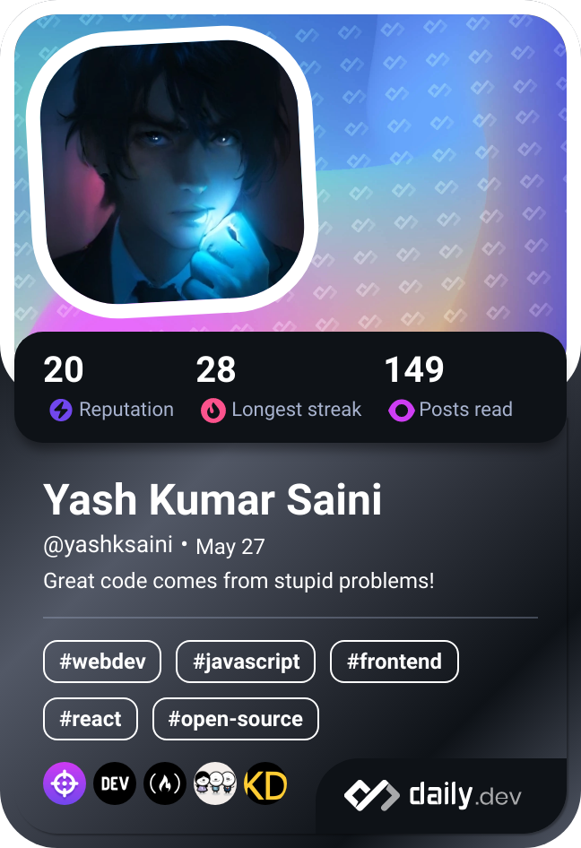
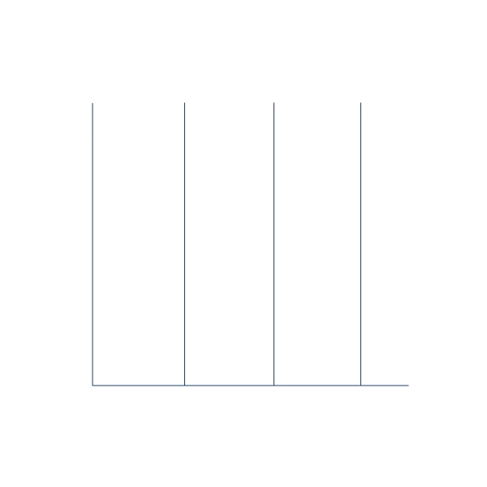

 <h1 align="center">
    
</h1>  

    

 
 
  
 

  
  

    <h1 align="left">💫 About Me</h1>

  🔭 I’m currently working on Regression-with-Flood-Prediction :wink:  
  👯 I’m looking to collaborate on Small scale Industry projects to learn how the execution takes place in big companies.  
  🤝 I’m looking for help with Artificial Intelligence & Generative AI 
  🌱 I’m currently learning Data Strucutres & Algorithms with Java 
   
  💬 Ask me about Data Science. 
  👨‍💻 All of my projects are available at [Here!](https://github.com/yashksaini-coder?tab=repositories) 
  📝 I regularly write articles on https://medium.com/@yashksaini 
  📫 You can reach me [📧](mailto:ys3853428@gmail.com)  
  

  

   <h1>✍️ Dev Quote</h1> 
  

   <h1 align="center">🌐 Socials</h1> 

  <h1 align="center">🏆 Trophies</h1>
  

  <h1> Skills 🛠️ 
  </h1>

 
| Category        | Skills        |
|-----------------|---------------|
| Frameworks|     |
| Languages       |        |
| Styling & Frameworks | |
| Database |    |
|DS\ML|     |
| Services & Tools|   |
| Competitive Coding |  |
| IDE & Environment |   |
| Hosting         |    |
| AI |  |
| Design Tools    |    |
| Learning |   |

  

 

  <h1 align="center"> ⚛️ Github Stats</h1>
	
  
	
    
  
  

    

  

 

 

  <h1>Summary</h1>

  <a href="https://github.com/yashksaini-coder">
  
  
  
  
  

 

  

 

    <h1>Metrics</h1>
      

 

  

  <h1>⚡Activity Graph</h1>
   

 

  <h1 align="center">🔥3D Contributions Chart</h1>
	<picture>
	  <source media="(prefers-color-scheme: dark)"  srcset="https://raw.githubusercontent.com/yashksaini-coder/yashksaini-coder/output-3d-contrib/night.svg"/>
	  <source media="(prefers-color-scheme: light)" srcset="https://raw.githubusercontent.com/yashksaini-coder/yashksaini-coder/output-3d-contrib/day.svg"/>
	  
	</picture>

