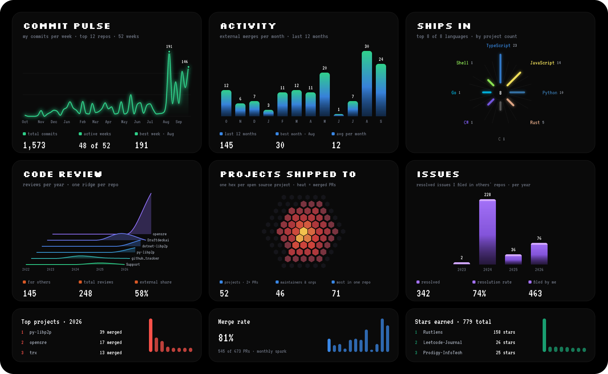
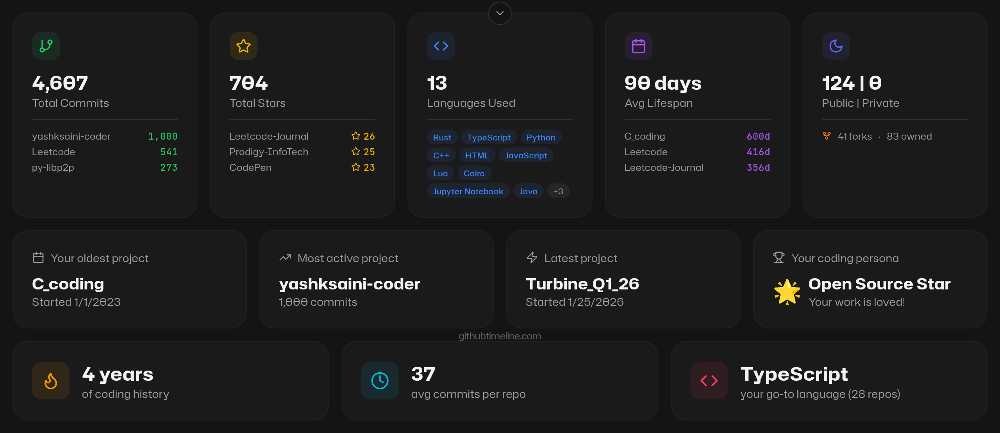

# 👨‍💻 Telling the machines what to do

<!--
### Hi there 👋, I'm **Open Source Developer**!

Building in public, share what I'm working on and learning. Currently learning about AI, ML, LLMs, RAG, System Design, DevOps, Web3, and more on low-level programming such as C, C++, and Rust.

Where I'm not working, I'm reading books and writing blogs, playing games is my thing, Grinding the burnout away.

##  | [Bounty 103$](https://x.com/yash_k_saini/status/1886322902573715709) | [Bounty 81$](https://x.com/0xCracked_dev/status/1951544807316201622) | [Bounty 7$](https://x.com/yash_k_saini/status/1883502087688073345) |

---

## 📝 What I've done
---

- Participated in ***[Kaggle](https://www.kaggle.com/yashsaini007)*** competitions (Competitions Contributor)
- Participated & won 5+ hackathons
- Built Python Packages during OSS events
- Writing blogs on **[Dev.to](https://dev.to/@yashksaini)** about my experiences and learnings

-->

 
<!--  -->

<!-- ## 📚 Latest Blog Posts -->

<!-- BLOG-POST-LIST:START -->
- [Dev log #17 From 16-bit TUIs to p2p Hardening: A 227-Commit Week](https://dev.to/yashksaini/dev-log-17-from-16-bit-tuis-to-p2p-hardening-a-227-commit-week-1cbg)
- [Gravy Theory: three chickens, one base](https://dev.to/yashksaini/gravy-theory-three-chickens-one-base-25h8)
- [Dev log #16 Typographic Hierarchy and the Great Obsidian Purge](https://dev.to/yashksaini/dev-log-16-typographic-hierarchy-and-the-great-obsidian-purge-3h5e)
- [Dev log #15 Refining the Craft: A week of Neovim UI hacking and portfolio architecture](https://dev.to/yashksaini/dev-log-15-refining-the-craft-a-week-of-neovim-ui-hacking-and-portfolio-architecture-45a2)
- [Dev log #14 Hardening the DHT against Eclipse attacks and the endless battle with flaky p2p tests](https://dev.to/yashksaini/dev-log-14-hardening-the-dht-against-eclipse-attacks-and-the-endless-battle-with-flaky-p2p-tests-593j)
- [Dev log #13 Hardening Kademlia: A week of p2p security architecture and Neovim maintenance](https://dev.to/yashksaini/dev-log-1-hardening-kademlia-a-week-of-p2p-security-architecture-and-neovim-maintenance-12jo)
<!-- BLOG-POST-LIST:END -->

<!-- Youtube video sections -->

<!-- ### 📺 Latest YouTube Videos -->

<!-- BEGIN YOUTUBE-CARDS -->

<!-- END YOUTUBE-CARDS -->

<!-- 

 -->

<!-- Support Me Here -->

<!-- #  Sponsor me -->

 

<!-- 
 -->

<!--  -->

<!-- sponsors -->

<!-- 

  
  
  </a>

 -->

